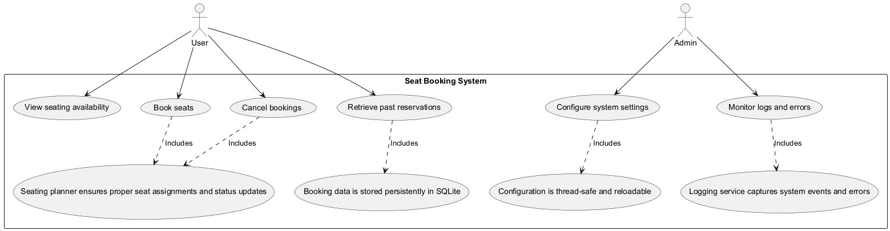

# Movie Ticket Booking System - Design Document

## Overview
This document outlines the architecture of the movie ticket booking system with a console-based UI.

## Files / Modules

### **Utilities**
- `app_configuration.py` ✅ - Provides singleton-based configuration management.
- `app_logging.py` ✅ - Ensures thread-safe logger setup and retrieval.

### **Booking System**
- `booking_repository.py` ✅ - Handles booking persistence using an SQLite database.
- `seating_planner.py` ✅ - Manages seat availability, booking logic, and cancellations.
- `shared_data_models.py` ✅ - Defines essential data structures such as `Seat`, `SeatingPlan`, and `SeatStatus`.

### **User Interaction**
- `console_ui.py` ✅ - Implements command-line interface prompts for user inputs and menu navigation.
- `main.py` ✅ - Acts as the application's central controller, coordinating interaction between components.

## **Functionality Overview**
- Users can:
  - **View seating availability**
  - **Book seats**
  - **Cancel bookings**
  - **Retrieve past reservations**
- Configuration is **thread-safe** and **reloadable** for dynamic updates.
- Booking data is stored **persistently** in an SQLite database.
- The **seating planner ensures** proper seat assignments and status updates.
- The console UI **provides a structured user experience** with clear prompts for actions.
- A logging service **captures system events and errors**, ensuring smooth operation.

## **File Details**
### `app_configuration.py`
Manages application configuration using a thread-safe singleton pattern.

#### **Classes**
- `ConfigurationError` – Custom exception for configuration-related errors.
- `SingletonMeta` – Implements a thread-safe singleton using weak references.
- `ConfigLoader` – Loads, validates, and manages configuration from JSON or a dictionary.
- `AppConfiguration` – Provides global access to application settings.

### `app_logging.py`
Manages application logging with singleton-based logger retrieval.

#### **Classes**
- `LoggingService` – Protocol for a logging service interface.
- `LoggerConfig` – Configures loggers with proper levels and handlers.
- `SingletonLogger` – Ensures a single logger instance across multiple threads.

### `booking_repository.py`
Handles booking operations using an SQLite database.

#### **Classes**
- `BookingRepositoryError` – Custom exception for booking-related errors.
- `IBookingRepository` – Protocol interface defining booking operations.
- `BookingRepository` – Implements seat booking persistence.

### `console_ui.py`
Provides a structured console-based user interface.

#### **Classes**
- `ConsoleUi` – Manages console interactions for seat bookings.

### `seating_planner.py`
Handles seating arrangement and availability.

#### **Classes**
- `SeatingPlanner` – Manages seat booking, availability, and cancellations.

### `shared_data_models.py`
Defines essential data structures.

#### **Classes**
- `MenuOption` – Defines possible user actions.
- `SeatStatus` – Loads seat status codes dynamically from configuration.
- `Seat` – Represents a seat with attributes for row, column, and status.
- `SeatingPlan` – Manages structured seating arrangements.

---
