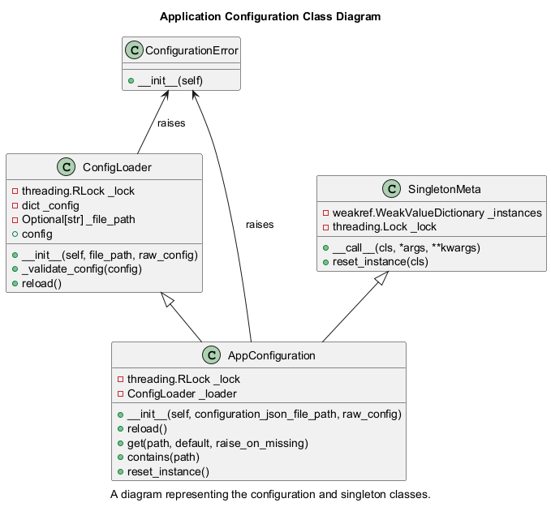
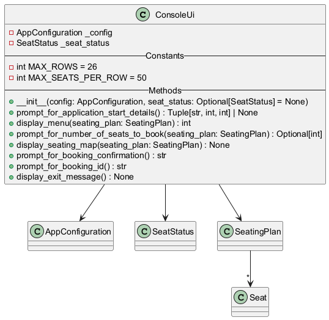
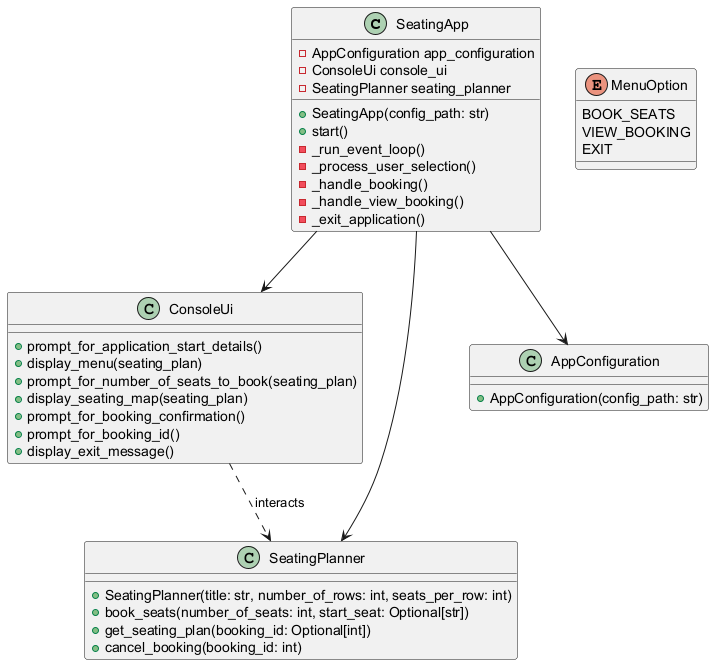
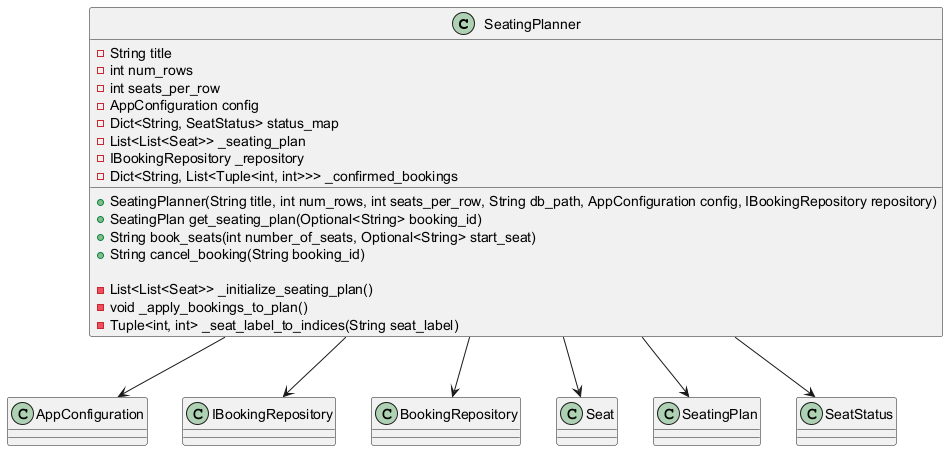
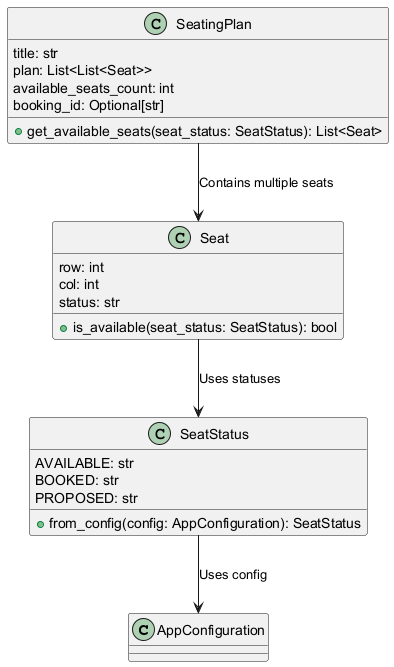

# Overview

Development notes for this application.

# Files / Modules

- Utilities
  - ✅ app_configuration.py 
  - ✅ app_logging.py

- ✅ booking_repository.py
- ✅ console_ui.py
- (?)fastapi_main.py -- if time permits
- ✅ main.py

- ✅ seating_planner.py
- ✅ shared_data_models.py

- Unit tests
  - ✅ test_app_configuration.py
  - ✅ test_app_logging.py
  - ✅ test_booking_repository.py
  - test_main.py
  - ✅ test_console_ui.py
  - ✅ test_seating_planner.py
  - ✅ test_shared_data_models.py

## File: app_configuration.py

ConfigurationError: Custom exception for configuration-related errors.

SingletonMeta: A metaclass implementing a thread-safe singleton pattern using weak references.
SingletonMeta.__call__: Ensures only one instance of a class is created.
SingletonMeta.reset_instance: Resets the singleton instance for testing purposes.

ConfigLoader: Loads, validates, and manages configuration from a JSON file or a dictionary.
ConfigLoader.__init__: Initializes configuration from a file or dictionary.
ConfigLoader._validate_config: Validates that the configuration is a dictionary.
ConfigLoader.reload: Reloads configuration from a JSON file.
ConfigLoader.config: Returns a deep copy of the current configuration.

AppConfiguration: Thread-safe singleton class providing access to application configuration.
AppConfiguration.__init__: Initializes the application configuration using a file or dictionary.
AppConfiguration.reload: Reloads configuration if loaded from a file.
AppConfiguration.get: Retrieves a configuration value using a colon-separated path.
AppConfiguration.contains: Checks if a configuration key exists.
AppConfiguration.reset_instance: Resets the singleton instance.

## File: app_logging.py

LoggingService: Defines a protocol for a logging service that retrieves a logger instance.

LoggerConfig: Manages the configuration and setup of logger instances, ensuring proper logging levels and handlers.
LoggerConfig.\\init\\(): Initializes the logger with a specified name, level, and handlers.
LoggerConfig.\_configure_logger(): Creates and configures the logger instance with handlers.
LoggerConfig.\_add_unique_handler(): Ensures that the logger does not duplicate handlers.
LoggerConfig.\_default_stream_handler(): Returns a default StreamHandler with a formatted output.

SingletonLogger: Implements a thread-safe singleton pattern to provide a single logger instance across multiple threads.
SingletonLogger.get_logger(): Provides access to the single logger instance, ensuring only one is created.

## File: booking_repository.py

BookingRepositoryError: Custom exception for booking-related errors.

IBookingRepository: Protocol interface defining booking operations.

BookingRepository: Implements booking persistence in an SQLite database.
BookingRepository._init_db(): Initializes the bookings table in the database.
BookingRepository.save_booking(): Saves a booking with a list of seat coordinates.
BookingRepository.delete_booking(): Deletes a booking by its ID.
BookingRepository.load_all_bookings(): Loads all bookings for a specific seating plan.
BookingRepository.booking_exists(): Checks if a booking exists in the database.
BookingRepository.clear_all_bookings(): Removes all bookings, mainly for testing purposes.

## File: console_ui.py

ConsoleUi: Manages console-based user interactions for booking movie tickets.
ConsoleUi.__init__: Initializes console UI with application configuration and seat status.
ConsoleUi.prompt_for_application_start_details: Collects and validates movie title and seating map details.
ConsoleUi.display_menu: Shows main menu options and retrieves user selection.
ConsoleUi.prompt_for_number_of_seats_to_book: Prompts user for seat booking quantity and validates availability.
ConsoleUi.display_seating_map: Displays the current seating map with labeled rows and columns.
ConsoleUi.propmpt_for_booking_confirmation: Asks user to confirm or modify seat selection.
ConsoleUi.prompt_for_booking_id: Collects booking ID from the user.

## File: main.py

SeatingApp – Manages the interaction between the console-based UI and the seating planner.
SeatingApp.__init__ – Initializes the application with configuration and UI components.
SeatingApp.start – Starts the application and initializes the seating planner.
SeatingApp._run_event_loop – Continuously processes user selections until exit.
SeatingApp._process_user_selection – Directs user choices to respective handlers.
SeatingApp._handle_booking – Facilitates seat booking and confirmation.
SeatingApp._handle_view_booking – Displays seating plans based on booking ID.
SeatingApp._exit_application – Exits the application gracefully.

## File: seating_planner.py

SeatingPlanner – Handles seat booking, seat status updates, and seating arrangements.
SeatingPlanner.__init__ – Initializes the seating plan with configurations and loads existing bookings.
SeatingPlanner._initialize_seating_plan – Creates an initial seating plan with all seats marked as available.
SeatingPlanner._apply_bookings_to_plan – Updates the seating plan based on confirmed bookings.
SeatingPlanner.get_seating_plan – Retrieves the current seating plan, optionally marking specific seats as proposed.
SeatingPlanner._seat_label_to_indices – Converts a seat label (e.g., 'A1') into row and column indices.
SeatingPlanner.book_seats – Books a number of available seats and assigns a unique booking ID.
SeatingPlanner.cancel_booking – Cancels an existing booking and frees up the previously occupied seats.

## File: shared_data_models.py

MenuOption – Defines possible user actions in the booking system.

SeatStatus – Holds seat status codes dynamically loaded from configuration.
SeatStatus.from_config(config) – Initializes seat statuses using a configuration object.

Seat – Represents a single seat with row, column, and status attributes.
Seat.is_available(seat_status) – Checks if a seat is available based on a given seat status.

SeatingPlan – Represents a structured seating plan with a list of seats and available seat count.
SeatingPlan.__post_init__() – Ensures the seating plan has valid data integrity.
SeatingPlan.get_available_seats(seat_status) – Retrieves all seats marked as available.

--- END-OF-FILE

# Seat Selection

Use the following rules for default seat selection:

1. Start from the furthest row from screen.
2. Start from the middle-most possible seat.
3. When a row is not enough to accommodate the number of tickets, it should overflow to the next row closer to screen.

User can choose seating position by specifying the starting position of the seats.
Seating assignment should follow this rule:
1. Starting from specified position, fill up all the empty seats in the same row all the way to the right of the cinema hall.
2. When there is not enough seats available, it should overflow to the next row closer to the screen.
3. Seat allocation for overflow follows the rules for default seat allocation.
